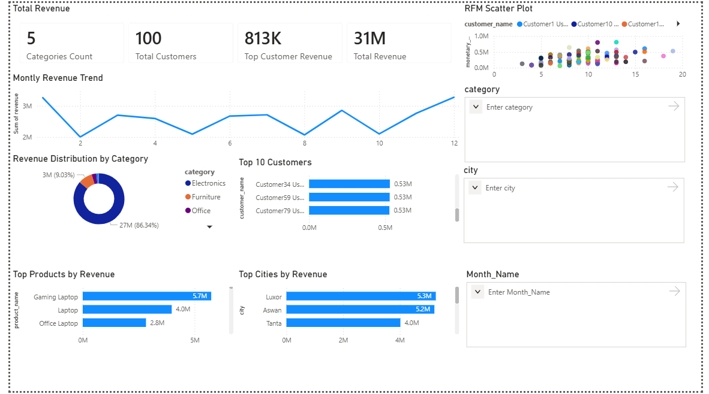
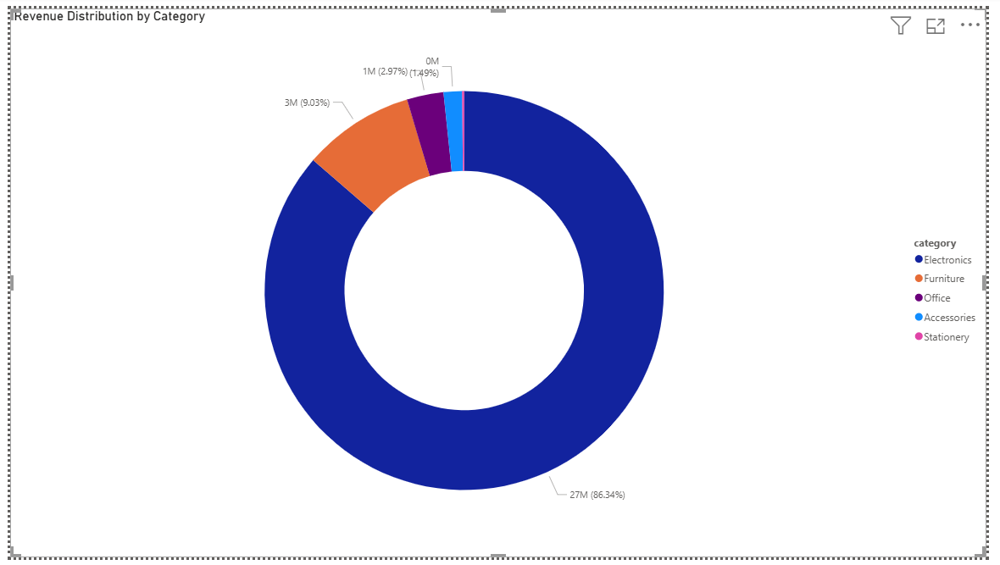
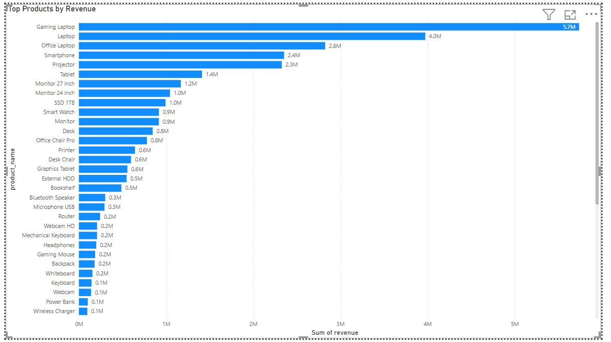
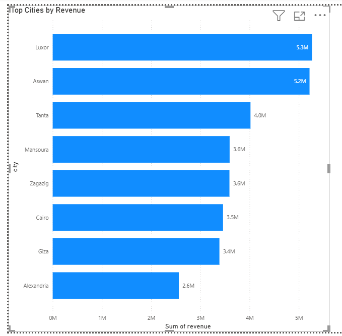

# Ecommerce Analytics Dashboard

## Project Overview

This project analyzes ecommerce sales data using SQL and Power BI.

The dashboard provides insights into:

- Revenue trends
- Product performance
- Customer segmentation
- Geographic sales distribution

---

## Dashboard KPIs

- Total Revenue
- Total Customers
- Revenue by Category
- Top Customers
- Top Products
- Revenue by City

---

## Dashboard Preview

### Executive Dashboard

### Revenue by Category

### Top Products

### Revenue by City

### RFM Analysis

---

## Tools Used

- MySQL
- Power BI
- Excel
- GitHub

---

## Key Insights

- Electronics generated the majority of revenue.
- A small number of customers contributed a large share of sales.
- Revenue varied significantly by city.
- RFM analysis identified high-value and inactive customers.
